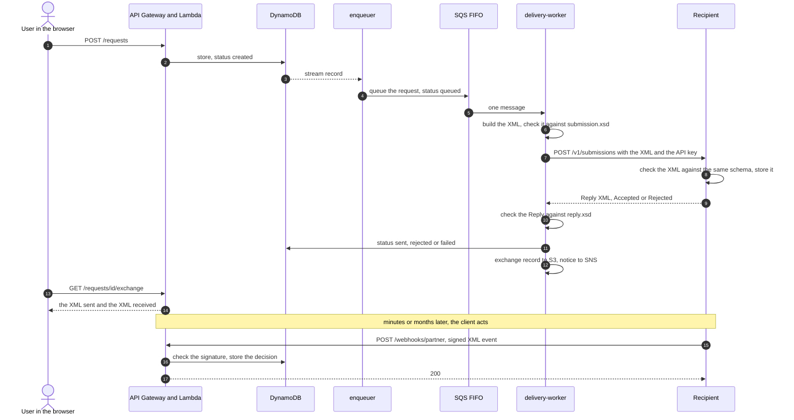

# aws-starter

A small reference project that shows how two independent systems exchange validated XML
messages, with the sending side built serverless on AWS: Terraform, Lambda, API Gateway,
DynamoDB, SQS FIFO, SNS, Cognito, S3, SSM, and a React frontend. The receiving side is a
separate application (`partner-sim/`, Python in Docker) that could live in any other cloud. The
two sides share nothing but `contracts/`: the XSD schemas, the HTTP contract and sample messages.

A user creates a request in the web app. It is stored, queued, turned into an XML message,
checked against a schema, sent over HTTPS to the recipient, and the recipient's XML answer is
checked and stored. The page then shows **the XML that was sent and the XML that came back**.

All data is fake. The domain is deliberately neutral. It runs inside the AWS Free Tier.

## How it fits together


What happens to one request:



Where each outcome ends:

| What happens | Status | Retried? |
|---|---|---|
| The recipient answers `200` and `Accepted` | `sent` | no |
| The recipient answers `Rejected` (`400`/`422`) | `rejected` | no |
| Our own message fails `submission.xsd`, or holds a character XML cannot carry | `rejected`, nobody is called | no |
| Timeout, `5xx`, `429`, `401`/`403`, an unreadable or contradictory answer | stays `queued` | yes, up to 5 receives |
| The 5th attempt fails | `failed`, an e-mail, and a **Send again** button on the request page | no, until the owner sends it again |

The status only says whether the message was **delivered**. What the client then does with it
(approves, for example pays; declines, for example out of stock) arrives later, by a webhook, as
a separate `clientDecision` on the request. It can come minutes or months after `sent`, so
nothing waits for it and nothing expires.

## Status

- [x] Stage 0: bootstrap (state bucket, budget alert, GitHub OIDC role)
- [x] Stage 1: REST API (API Gateway, Lambda, DynamoDB), Cognito, React login + list/form, CI/CD
- [x] Stage 2: async delivery (stream outbox, SQS FIFO, worker, DLQ, SNS). Checked on AWS
  with three requests: delivered, refused and failing (five attempts, then `failed`; at that
  stage the message also went to the DLQ, which stage 5 changed).
- [x] Stage 3: the recipient as a separate system, XML + XSD validation on both sides, the
  exchange record and its panel in the UI, the API key in SSM. Checked on AWS with the recipient
  running in Docker (first on a laptop behind a tunnel, now on a free container host): a request delivered in about two
  seconds, one refused by the recipient, one refused by our own schema check without calling
  anybody, one retried five times until `failed` (8 minutes), and one that waited while the
  recipient was down and was delivered on the second attempt after it came back. The logs of
  those runs contain no message text.
- [x] Stage 4: the client's decision by webhook: the recipient calls a public, signed route
  when the client approves or declines, whenever that happens. Checked on AWS with the recipient
  in Docker: a call without a signature and one with a wrong signature get `401`; Approve stores
  the decision (a reason with `&`, `<` and Cyrillic arrives byte for byte through API Gateway);
  Send again changes nothing; a later Decline replaces it; the delivery status stays `sent`. The
  logs of those calls contain no reason text and no token. A second `terraform plan` after the
  deploy shows no changes.
- [x] Stage 5: send a failed request again (a button on the request page). Checked on AWS: with the
  recipient stopped a request went through five attempts to `failed` and the DLQ stayed empty;
  with the recipient back, Send again delivered it (`sent`, the exchange counts from attempt 1);
  pressing again, or on a delivered request, gets `409`; another user's or a malformed id gets
  `404`. A second `terraform plan` after the deploy shows no changes.
- [x] Stage 6: the logs are guarded by the logger (only listed fields, each with a shape; see
  Decisions). Checked: every log group was searched for the text of about twenty live test requests
  before the change (no hit); after the deploy, traffic through every function, error paths
  included (a broken JSON body and invalid fields carrying a marker string), left no marker string
  and no `[unlisted]` or `[rejected]` in 97 log lines, and the lines still carry ids, outcomes and
  counts.
- [x] Stage 7: the recipient off the laptop: its image is built and published by a workflow and runs on
  a free container host (Northflank sandbox, London) with a volume for its database. Checked: the
  image starts as published, its key and login work, a message survived a rollout restart, and the
  whole loop from AWS (delivery, Approve, Send again, Decline) ran against it.

## Try it

### 1. The recipient, on your computer (two minutes, no AWS needed)

Needs Docker. From the repository root:

```sh
cd partner-sim && docker compose up --build -d
cd ..
curl -s -X POST http://127.0.0.1:8080/v1/submissions \
  -H 'X-API-Key: demo-key-change-me' -H 'Content-Type: application/xml' \
  --data-binary @contracts/fixtures/submission/valid/minimal.xml
```

You get a `Reply` document with `Accepted`. Open <http://127.0.0.1:8080/> (login `demo`,
password `demo-password-change-me`) to see it in the inbox. [`partner-sim/README.md`](partner-sim/README.md)
has the other cases (schema violations, DOCTYPE attacks, wrong key, too large) and how to look
at the database.

### 2. The AWS side

You need an AWS account with credentials in your shell, Terraform 1.16, Node 24 with Corepack,
and a GitHub repository (a fork of this one) that the deploy role trusts. It is built to stay
inside the AWS Free Tier, and a budget alert is created before anything else. The steps below
were run on the author's account (through CI); a from-scratch run on a second account has not
been done.

```sh
# 1. Once per account: the state bucket, a budget alert and the GitHub deploy role.
#    Follow "Running bootstrap" at the end of this file.

# 2. The application stack
cd infra/envs/dev
echo "bucket = \"aws-starter-tfstate-$(aws sts get-caller-identity --query Account --output text)\"" > backend.tfbackend
cp terraform.tfvars.example terraform.tfvars   # edit: Cognito domain prefix, e-mail, partner_url
export TF_VAR_partner_api_key='<a secret of 16+ characters: the same value as the recipient PARTNER_API_KEY>'
export TF_VAR_webhook_token='<a secret of 16+ characters: the same value as the recipient WEBHOOK_TOKEN>'
(cd ../../.. && corepack enable && yarn install && yarn workspace @aws-starter/backend build)
terraform init -backend-config=backend.tfbackend && terraform apply
```

`partner_url` is where the AWS side finds the recipient: `https://<host>` with no path. AWS
cannot reach `127.0.0.1`, so run the published image (`ghcr.io/<owner>/aws-starter-partner-sim`)
on a container host with your own API key, password and webhook token
(`partner-sim/README.md`, "Running it on a hosting platform": the free Northflank sandbox worked,
a card is needed for verification and the 6 GB volume for `/data` costs $0.90 a month). Confirm the
two SNS e-mail subscriptions (request status, alerts) that AWS sends to the address you gave.

Run the web app against the deployed API:

```sh
cd frontend
cp .env.example .env.local     # fill it from `terraform output` in infra/envs/dev
yarn dev                       # http://localhost:5173
```

Or let GitHub Actions do the whole thing after every merge to `main`: set the secrets
`AWS_DEPLOY_ROLE_ARN`, `NOTIFICATION_EMAIL`, `PARTNER_API_KEY`, `PARTNER_WEBHOOK_TOKEN` and the variables
`COGNITO_DOMAIN_PREFIX`, `PARTNER_URL` (`.github/workflows/deploy.yml` builds, plans, applies,
and publishes the site to CloudFront). The deploy refuses to delete anything unless run by hand
with `allow_destroy`.

### 3. A demo script

Sign up in the web app, then create requests (the partner name may hold letters, digits, space
and `. , ' & -` only, because the recipient's schema says so):

| Create | You see |
|---|---|
| any subject, partner `Acme Ltd` | `sent` within seconds; the Exchange panel shows the XML and the `Accepted` reply |
| `[reject]` in the subject | `rejected`; the reply says `RECIPIENT_REJECTED` |
| `[fail]` in the subject | retried for about 8 minutes (five attempts), then `failed` with an e-mail; press **Send again** and it goes through delivery again (and fails again, the subject says so) |
| partner `Acme #1` | `rejected` at once: our own schema check refuses it and nobody is called |
| in the recipient's inbox (`WEBHOOK_URL` = the `webhook_url` output, `WEBHOOK_TOKEN` = yours), open a delivered message and press **Approve** or **Decline** with a reason | the request page shows the Client decision card within about 30 seconds (a reload shows it at once) |
| stop the recipient, create a request, wait for `failed` (about 8 minutes), start the recipient, press **Send again** | the request goes through delivery again and becomes `sent` |
| press Approve, then Decline | the later action wins: the card shows Declined |
| press **Send again** on an event | the same event again: nothing changes |
| stop (pause) the recipient, create a request, start it again within the retries (about 8 minutes) | the Exchange panel shows the failed attempt (`retry`, a `502`/`503` from the host), then the request is delivered on the next attempt, two minutes after the first |

## Layout

```
bootstrap/   one-off Terraform: state bucket, budget, GitHub OIDC role
infra/       main Terraform stack (remote state), modules per service
backend/     Node.js + TypeScript Lambda handlers (handlers -> services -> repositories)
frontend/    React app (Feature-Sliced Design)
contracts/   what both sides share: XSD schemas, the HTTP contract, sample messages
partner-sim/ the recipient: a separate Python app (FastAPI, lxml, SQLite, Docker)
docs/        API and delivery contract (docs/api.md)
```

## Decisions

Written down as they are made; each stage adds its own.

- **Region `eu-north-1`.** Everything used here is available there and it is one
  of the cheaper regions.
- **Terraform state in S3 with native locking** (`use_lockfile`, Terraform >= 1.10),
  so there is no DynamoDB lock table to maintain. The bootstrap stack keeps its own
  state in the bucket it creates (one-time migration after the first apply). The bucket
  name is passed through a git-ignored `backend.tfbackend`, so the account ID is not
  committed.
- **GitHub Actions authenticates via OIDC**, not access keys. The trust policy is
  pinned to this repository's `main` branch, using GitHub's immutable subject claim (it
  carries the numeric owner and repository IDs, so a renamed or re-created repository
  does not inherit the trust).
- **Cost guard first**: an account-wide budget with e-mail alerts is created before
  any application resources.
- **DynamoDB in provisioned mode, small and fixed (5 RCU / 5 WCU, no autoscaling).**
  The load is tiny and predictable, and this stays inside the always-free limits.
  On-demand would be the choice for spiky or unknown traffic.
- **Request statuses separate temporary from permanent failures:** `created` (stored)
  -> `queued` (in SQS FIFO) -> `sent` (the recipient accepted it). `failed` means delivery
  retries are exhausted (the owner can send it again); `rejected` means the message was
  refused for good (the recipient said no, or our own XSD check failed) and is not retried.
- **HTTP API instead of REST API.** Cheaper, lower latency and it has a built-in JWT
  authorizer, so no authorizer Lambda is needed. The REST-only features (API keys,
  usage plans, request validation) are not needed here.
- **Cognito: Essentials tier with the classic hosted UI** instead of managed login. The
  classic UI covers login, logout and password reset, and managed login needs an extra
  branding resource before it renders anything.
- **Outbox through DynamoDB Streams.** The API only writes to the table; the stream feeds
  an `enqueuer` Lambda that puts the request on the queue. A request cannot be stored
  without also being queued (at least once), and the API has no queue permissions. Rejected:
  the API sending to SQS after the write, which leaves a gap when the send fails.
- **SQS FIFO with a hashed partner as the message group, one message per invocation.** The
  group id is a hash of the partner name (a group id may only hold letters, digits and
  punctuation, and a partner is free text), so order is kept per partner. Batch size is 1:
  in a FIFO batch a failing message drags the messages behind it, other partners' included,
  into retries, and each retry is charged a receive, so they could reach the DLQ untried.
- **The worker writes `failed` itself on the last attempt** (the number of attempts comes from
  Terraform, one source of truth), sends the e-mail and acknowledges the message: a failure the
  owner can act on is a state of the request, not a stuck message.
- **The dead-letter queue is a quarantine, not a pipe, and it is for what could not be processed
  at all** (a malformed message, an unknown request, an error of ours). It stays for inspection and
  raises an alarm; nothing reads it automatically, because a function reading it would delete
  exactly what the alarm is meant to show. Earlier a delivery that ran out of attempts went there
  too; with a Send again button that would have left a stale message and an alarm after every
  successful retry.
- **Sending a failed request again is a state change, and the queue message is only a pointer.**
  The message holds two ids; the request (its text, the partner, the status) is in DynamoDB. So
  `POST /requests/{id}/retry` only flips `failed` to `created` with a conditional update, and the
  table's stream makes the enqueuer put a new message on the queue, the same outbox as for a new
  request (the API needs no queue permission). The stream carries only the new image, so the
  enqueuer's filter cannot ask "was it failed?": the API's condition guarantees it, and the
  deduplication id carries the retry count so the second send is never taken for a duplicate of
  the first. `rejected` cannot be sent again: the same message would get the same answer.
- **A 401 or 403 from the partner is retried, not rejected.** It means our own credentials or
  permissions are wrong, so it ends as `failed` with an alarm instead of a silent `rejected`.
- **The recipient is a separate system, not part of the AWS stack.** This stack knows its base
  URL and an API key, nothing else; the two sides share only `contracts/` (XSD, HTTP contract,
  sample messages) and each validates against its own copy. It could live in another cloud, so
  a mock inside this account would have shown nothing about the interface. The stand-in,
  `partner-sim/`, is a Python app (a different stack on purpose: a Node.js sender and a Python
  recipient show that the contract works, not the code). Rejected: a Lambda mock in this account.
- **The API key lives in SSM Parameter Store (SecureString), written with a write-only
  argument.** Terraform sends it to SSM and stores it neither in state nor in a plan file; the
  price is that a rotation needs a version bump (documented at the parameter). Rejected: Secrets
  Manager (billed per secret), an environment variable (visible in the console).
- **The exchange record is one S3 object per request**, holding the XML sent and the reply, read
  back by `GET /requests/{id}/exchange`. One object, so a reader never sees the request of one
  attempt next to the reply of another. The function that reads it may list the bucket:
  without that, S3 answers a missing key with 403 and "no exchange yet" would look like an error.
- **Alarms treat missing data as fine, and the SNS topics are not KMS-encrypted.** An idle
  queue publishes no metric, and encrypted topics can only receive CloudWatch alarms through a
  customer-managed key. The messages hold ids and alarm data, never request text.

- **XSD validation with libxml2 on both sides**: `xmllint-wasm` in the Node.js sender, `lxml` in
  the Python recipient. Both need full XSD 1.0 with `xs:import`, which the pure-JavaScript
  validators do not offer, and a native binary is a build problem on Lambda; WebAssembly is
  neither. The honest limit: both sides run the same engine, so the shared fixtures
  (`contracts/fixtures/expected.json`, run by both test suites) prove that the two
  implementations agree on the contract, not that two independent validators agree.
- **`xmllint-wasm` is not bundled.** It starts a worker thread from a script file and reads its
  `.wasm` next to itself, so inside one bundled `.mjs` it fails. The build leaves it out and copies
  the package next to the function (`dist/delivery-worker/node_modules`), together with the three
  schema files. Cost: about 70 ms per validation and a 6.9 MB unzipped package.
- **What the validator reports never contains a value.** libxml2 messages quote the offending
  value, and values are personal data. The sender turns each message into an element name and a
  rule from closed lists, and the logs carry the same. Tests put a canary string into every field
  and look for it in the findings and in every log line.
- **The recipient's answer is untrusted input.** At most 64 KiB (counted while it streams),
  UTF-8 only, any DOCTYPE refused before parsing (entity expansion, XXE), redirects never
  followed (the API key must not travel to another host), checked against `reply.xsd` and against
  the rule XSD 1.0 cannot express (`Code` and `Description` exactly when `Rejected`). Anything
  the contract does not define, or a reply that contradicts its own status, is retried: never a
  silent "sent" or "rejected".
- **A reply is read by a real XML parser (`@xmldom/xmldom`), after libxml2 has judged it valid.**
  A regular expression is wrong for valid documents (comments, CDATA, namespace prefixes).
  Rejected: `fast-xml-parser` (six dependencies of its own).
- **Idempotency across the two systems**: the `MessageId` of a message is the request id. A
  repeated delivery gets the stored answer back, so a retry after a crash cannot deliver twice.
- **The client's decision is its own field, not a status.** A status says whether the message was
  delivered; the decision is what a person then did, on their own time. Keeping them apart means
  an event may arrive before the worker has written `sent` (it is accepted anyway), and no timer or
  alarm waits for it: a payment can take days.
- **The webhook is public, and the signature is the door.** No Cognito token (the caller is another
  system), so the function checks an HMAC-SHA256 over the timestamp and the body with a shared token
  from SSM, in constant time, and the check runs in two steps: the shape of the headers and the age
  (300 seconds, against replay) first, the token only after that, so that junk from the internet
  cannot cost an SSM call. Nothing else, no parsing and no database, happens before it is right. The
  route has a lower throttle than the rest of the API. Rejected: a static token in a header (it
  travels, and a captured request could be replayed).
- **Events are found by id and applied by one conditional write.** The event names the request, not
  its owner, so a small index on the sort key (`by-request-id`, keys only) finds it. One
  `UpdateItem` with a condition keeps the latest `OccurredAt`, ignores the same event again and a
  late old one, and never creates an item; `ALL_OLD` on a failed condition tells the cases apart
  without a second read.
- **The recipient's side of the action is a person, not a timer.** In `partner-sim` two buttons send
  the event, one attempt per click, and "Send again" repeats the same event, which is how the
  receiver's idempotency is seen.
- **The logs are guarded by the logger, not only by care.** The rule "no message text, names,
  reasons or tokens in a log" was a convention for whoever writes a log call. Now every field is on
  a list with a shape for its value (an id, a word from a closed list, a number), anything else is
  written as `[unlisted]` or `[rejected]` with the value dropped, and the text of an error has its
  quoted pieces replaced (parsers quote the value that failed them: `Unexpected token 'a', "..."`).
  In tests the guard throws, so a wrong log call fails the build. The shape matters as much as the
  name: `reason` is a fixed word in the worker and free text in an event from the recipient. Rejected:
  a list of forbidden names (it fails the day somebody picks another name), and CloudWatch's data
  protection policies (billed per GB scanned, so not free).
- **The recipient runs on a free container host, not on a laptop.** A laptop that sleeps breaks
  deliveries and keeps the data on a personal machine. The image is built by a workflow, so what runs
  is what was tested, and the host only pulls it. Rejected: Render's free tier (no persistent disk,
  so the database is wiped at every redeploy, and it sleeps after 15 minutes without traffic, which
  needs a pinger); Fly.io, Railway and Koyeb (no longer a free tier that fits). Northflank's sandbox
  asks for a card and charges for the volume ($0.15 per GB per month, 6 GB minimum); that is the price
  of a database that survives a restart.

## Limits

- It shows an architecture; it is **not** a real e-prescription or NCPDP implementation. The
  message and its schemas are neutral and illustrative.
- Demo scale on purpose: DynamoDB 5/5 provisioned units, the account's Lambda concurrency of 10,
  one delivery at a time per partner name, the worker at most two at once.
- The recipient is a simulator with one shared API key and one inbox login, on the public internet
  around the clock, with no rate limit on its login. It runs on a free container host (a card for
  verification, $0.90 a month for the volume, an image that has to be redeployed by hand); while it
  is down, deliveries are retried and finally fail.
- The exchange record holds the message text (S3, SSE-S3, deleted after 30 days) and can be read
  only by the owner of the request. Logs are designed to carry no message text; a full review of
  them is still to do.
- Both validators are libxml2 (see Decisions).
- The log guard knows shapes, not meaning: a one-word value in a field that takes a word passes, and
  the text of an error is scrubbed of quotes and capped but not otherwise inspected. It covers the
  Lambdas. The recipient writes to its container's output, and its host terminates TLS and can see the
  traffic: fine for fake data, not for real data.
- Sending again has no limit on how often it is used, and only a `failed` request can be sent
  again. There is no tool to redrive the DLQ: an operator moves those messages by hand.
- The webhook is authenticated by a shared token, and rotating it is a manual step on both sides.
  Once the signature is right the recipient is trusted: an `OccurredAt` far in the future would keep
  the decision from ever being replaced.
- The page looks for a decision every 30 seconds while the tab is visible and the request is `sent`
  without one, and stops at the first decision; a later, changed decision shows after a reload.

## Running bootstrap

Once per AWS account. It creates the Terraform state bucket, a monthly budget alert and the
role GitHub Actions uses to deploy.

```sh
cd bootstrap
cp terraform.tfvars.example terraform.tfvars      # edit: your e-mail and your GitHub repository
# The state bucket does not exist yet, so the first run uses local state:
mv backend.tf backend.tf.off
terraform init && terraform apply
mv backend.tf.off backend.tf
# Then move the state into the new bucket:
echo "bucket = \"aws-starter-tfstate-$(aws sts get-caller-identity --query Account --output text)\"" > backend.tfbackend
terraform init -migrate-state -backend-config=backend.tfbackend
```

`terraform output github_deploy_role_arn` is the value of the GitHub secret `AWS_DEPLOY_ROLE_ARN`.
