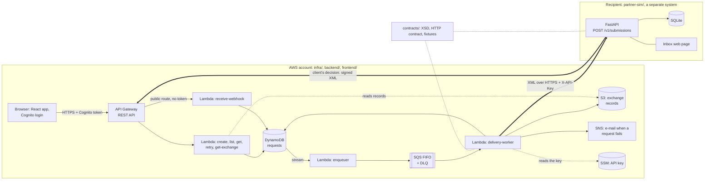
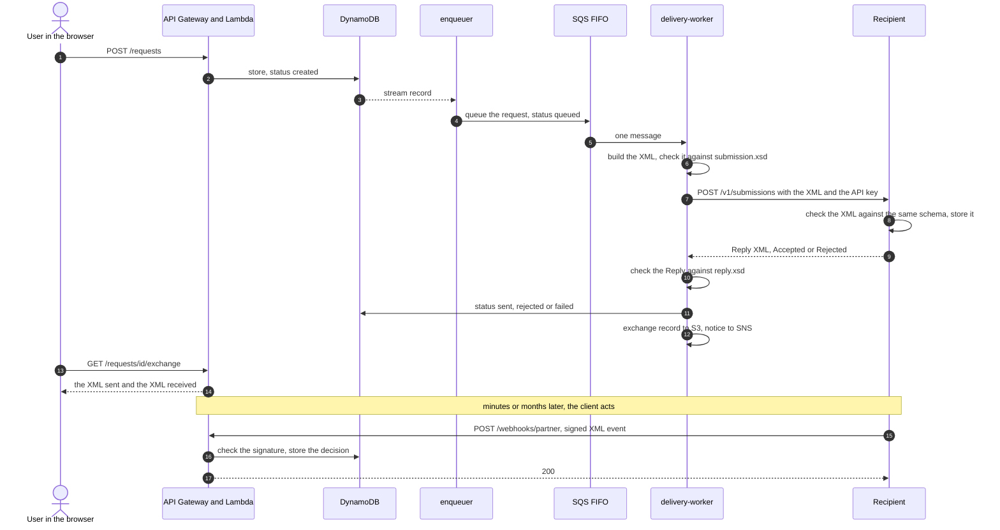

# aws-starter

A small reference project that shows how two independent systems exchange validated XML
messages, with the sending side built serverless on AWS. The receiving side is a separate
application (`partner-sim/`) that could live in any other cloud — the two sides share nothing
but `contracts/`: the XSD schemas, the HTTP contract and sample messages.

A user creates a request in the web app. It is stored, queued, turned into an XML message,
checked against a schema, sent over HTTPS to the recipient, and the recipient's XML answer is
checked and stored. The page then shows **the XML that was sent and the XML that came back**.

All data is fake, the domain is deliberately neutral, and it runs inside the AWS Free Tier.

## The partner simulator

`partner-sim/` plays the **recipient** of the messages, not a stand-in inside the AWS account:
it could live in any other cloud, and this stack knows only its base URL and an API key. The two
sides share nothing but `contracts/` (the XSD schemas, the HTTP contract, sample messages) — a
mock built into this AWS account would have shown nothing about the interface itself.

It can run entirely on your computer, no AWS needed — see "Try it" below. Today, though, it runs
on a free container host instead of a laptop, because AWS cannot reach a laptop's `127.0.0.1` —
the recipient needs a stable public address for the AWS side to call it.

## Stack

**Backend**
- Node.js 24 (arm64), TypeScript strict, esbuild, Vitest, Yarn workspaces.
- Layered: handlers -> services -> repositories, with Inversify for dependency injection (the
  container is built once per cold start).
- AWS SDK v3: DynamoDB (Streams as the outbox), SQS FIFO (idempotent by the request id), SNS, S3,
  SSM Parameter Store.
- Structured JSON logging: every field is checked against an allowlist and a shape before it's
  written, not a denylist of what to keep out.

**Frontend**
- React 19, Vite, MobX, Tailwind, Feature-Sliced Design (a layer imports only from the layer
  below it).
- Cognito's classic hosted UI for login, logout and password reset.
- Vitest and Testing Library for component and store tests.

**Infrastructure / Observability**
- Terraform, state in S3 with native locking (`use_lockfile`) — no DynamoDB lock table to run.
- GitHub Actions, deploying via OIDC — no long-lived AWS keys.
- DynamoDB in provisioned capacity mode, a fixed 5 RCU / 5 WCU.
- API Gateway REST API (not HTTP API), with a Cognito user-pool authorizer and per-method
  throttling.
- CloudWatch: structured JSON logs with Logs Insights queries, custom metrics and alarms, a
  dashboard with three SLOs (API availability, delivery success, time to sent).
- Distributed tracing: X-Ray with the OpenTelemetry API, via AWS's own Lambda layer
  (`AWSOpenTelemetryDistroJs`) — one trace per request, carried by hand across the queue and the
  webhook.
- Long-term log archive in S3, queried with Athena.

**XML / XSD**
- XSD validation uses libxml2 (via `xmllint-wasm`, compiled to WebAssembly) so both sides of the
  exchange validate against the same engine; it can't be bundled by esbuild, so the build copies
  it next to the Lambda package as a separate step.
- The recipient's reply, once libxml2 has judged it valid, is parsed by a real XML parser
  (`@xmldom/xmldom`) rather than a regular expression, which breaks on comments, CDATA or a
  namespace prefix.

**Partner simulator**
- Python, FastAPI, lxml, SQLite (`partner-sim/`). Schema migrations are numbered SQL files
  tracked by SQLite's own `PRAGMA user_version` — no migration table, no Alembic.
- Hosted today on Northflank's free container sandbox, with a persistent volume so the SQLite
  file survives a redeploy.

## Layout

```
bootstrap/   one-off Terraform: state bucket, budget, GitHub OIDC role
infra/       main Terraform stack (remote state), modules per service
backend/     Node.js + TypeScript Lambda handlers (handlers -> services -> repositories)
frontend/    React app (Feature-Sliced Design)
contracts/   what both sides share: XSD schemas, the HTTP contract, sample messages
partner-sim/ the recipient: a separate Python app (FastAPI, lxml, SQLite, Docker)
docs/        API and delivery contract (docs/api.md)
```

## How it fits together



## Try it

You need an AWS account with credentials in your shell, Terraform 1.16, and the GitHub CLI
(`gh`, authenticated) with a GitHub repository (a fork of this one) that the deploy role will
trust — all from step 1, below. Step 2 additionally needs Node 24 with Corepack, to build the
backend before `terraform apply`. The steps below were run on the author's account (through CI);
a from-scratch run on a second account has not been done.

### 1. Once per account: bootstrap

Creates the Terraform state bucket, a monthly budget alert and the role GitHub Actions uses to
deploy.

```sh
cd bootstrap
cp terraform.tfvars.example terraform.tfvars
# edit: your e-mail (alert_email), and github_oidc_subject_prefix from
#   gh api repos/<owner>/<repo>/actions/oidc/customization/sub --jq .sub_claim_prefix
# The state bucket does not exist yet, so the first run uses local state:
mv backend.tf backend.tf.off
terraform init && terraform apply
mv backend.tf.off backend.tf
# Then move the state into the new bucket:
echo "bucket = \"aws-starter-tfstate-$(aws sts get-caller-identity --query Account --output text)\"" > backend.tfbackend
terraform init -migrate-state -backend-config=backend.tfbackend
```

`terraform output github_deploy_role_arn` is the value of the GitHub secret `AWS_DEPLOY_ROLE_ARN`.

### 2. The AWS application stack

The budget alert from step 1 is already watching the account; everything here stays inside the
AWS Free Tier.

**`partner_url` (below) must already be a real, reachable address.** If you haven't hosted the
recipient yet, do the "host it somewhere public" part of step 3, note its URL, then come back —
or apply now with a placeholder `https://` address and fix it in a second, harmless `apply` once
step 3 is done (Terraform only checks the format here, not that anything answers).

```sh
cd infra/envs/dev
echo "bucket = \"aws-starter-tfstate-$(aws sts get-caller-identity --query Account --output text)\"" > backend.tfbackend
cp terraform.tfvars.example terraform.tfvars   # edit: Cognito domain prefix, e-mail, partner_url
export TF_VAR_partner_api_key='<a secret of 16+ characters: the same value as the recipient PARTNER_API_KEY>'
export TF_VAR_webhook_token='<a secret of 16+ characters: the same value as the recipient WEBHOOK_TOKEN>'
(cd ../../.. && corepack enable && yarn install && yarn workspace @aws-starter/backend build)
terraform init -backend-config=backend.tfbackend && terraform apply
```

Confirm the two SNS e-mail subscriptions (request status, alerts) that AWS sends to the address
you gave.

**Environment variables**, where each comes from and where it's set:

| Variable | Value comes from | Set in |
|---|---|---|
| `cognito_domain_prefix` | a name you choose (must be globally unique in the region) | `infra/envs/dev/terraform.tfvars` |
| `notification_email` | your e-mail, for SNS notices and alarms | `terraform.tfvars` (CI: GitHub secret `NOTIFICATION_EMAIL`) |
| `partner_url` | the recipient's public base URL once it's hosted (step 3, below) | `terraform.tfvars` (CI: GitHub variable `PARTNER_URL`) |
| `TF_VAR_partner_api_key` | a secret of 16+ characters, shared with the recipient's `PARTNER_API_KEY` | exported in the shell before `terraform apply`, never written to a file (CI: GitHub secret `PARTNER_API_KEY`) |
| `TF_VAR_webhook_token` | a secret of 16+ characters, shared with the recipient's `WEBHOOK_TOKEN` | exported in the shell (CI: GitHub secret `PARTNER_WEBHOOK_TOKEN`) |
| `VITE_AWS_REGION`, `VITE_COGNITO_USER_POOL_ID`, `VITE_COGNITO_CLIENT_ID`, `VITE_COGNITO_HOSTED_UI_URL`, `VITE_API_URL` | `terraform output` after `apply` | `frontend/.env.local` |
| `AWS_DEPLOY_ROLE_ARN` | `terraform output github_deploy_role_arn` from bootstrap | GitHub secret (repo Settings -> Secrets and variables -> Actions) |
| `COGNITO_DOMAIN_PREFIX`, `PARTNER_URL` | same values as the `terraform.tfvars` entries above | GitHub variable |
| `NOTIFICATION_EMAIL`, `PARTNER_API_KEY`, `PARTNER_WEBHOOK_TOKEN` | same values as above | GitHub secret |

Run the web app against the deployed API:

```sh
cd frontend
cp .env.example .env.local     # fill it from `terraform output` in infra/envs/dev
yarn dev                       # http://localhost:5173
```

Or let GitHub Actions do the whole thing after every merge to `main`: set the secrets and
variables in the table above (`.github/workflows/deploy.yml` builds, plans, applies, and
publishes the site to CloudFront). The deploy refuses to delete anything unless run by hand
with `allow_destroy`.

### 3. The partner simulator

Locally, for a quick check (two minutes, no AWS needed) — needs Docker:

```sh
cd partner-sim && docker compose up --build -d
cd ..
curl -s -X POST http://127.0.0.1:8080/v1/submissions \
  -H 'X-API-Key: demo-key-change-me' -H 'Content-Type: application/xml' \
  --data-binary @contracts/fixtures/submission/valid/minimal.xml
```

You get a `Reply` document with `Accepted`. Open <http://127.0.0.1:8080/> (login `demo`,
password `demo-password-change-me`) to see it in the inbox. [`partner-sim/README.md`](partner-sim/README.md)
has the other cases (schema violations, DOCTYPE attacks, wrong key, too large) and how to look
at the database.

For the AWS side above to actually reach it, host it somewhere public: run the published image
(`ghcr.io/<owner>/aws-starter-partner-sim`) on a container host with your own API key, password
and webhook token (`partner-sim/README.md`, "Running it on a hosting platform": the free
Northflank sandbox worked, a card is needed for verification and the 6 GB volume for `/data`
costs $0.90 a month). That address is `partner_url` in step 2, above.

The other direction is the recipient's `WEBHOOK_URL`, the `webhook_url` Terraform output. It
contains the API Gateway stage (`https://<id>.execute-api.<region>.amazonaws.com/v1/webhooks/partner`),
and it is a new value whenever the API is created again (as when it became a REST API): set it in
the recipient after such a deploy, or its calls go to an address that no longer exists.

The recipient's own variables (`PARTNER_API_KEY`, `WEBHOOK_URL`, `WEBHOOK_TOKEN`, `UI_USER`,
`UI_PASSWORD`, ...) are documented in [`partner-sim/README.md`](partner-sim/README.md#configuration),
"Configuration" — set them on whichever host runs it, matching the values in step 2's table.

## What happens to one request



Where each outcome ends:

| What happens | Status | Retried? |
|---|---|---|
| The recipient answers `200` and `Accepted` | `sent` | no |
| The recipient answers `Rejected` (`400`/`422`) | `rejected` | no |
| Our own message fails `submission.xsd`, or holds a character XML cannot carry | `rejected`, nobody is called | no |
| Timeout, `5xx`, `429`, `401`/`403`, an unreadable or contradictory answer | stays `queued` | yes, up to 5 receives |
| The 5th attempt fails | `failed`, an e-mail, and a **Send again** button on the request page | no, until the owner sends it again |

The status only says whether the message was **delivered**. What the client then does with it
(approves, for example pays; declines, for example out of stock) arrives later, by a webhook, as
a separate `clientDecision` on the request. It can come minutes or months after `sent`, so
nothing waits for it and nothing expires.

## A demo script

Sign up in the web app (any e-mail Cognito accepts) and create requests: a subject and a message,
nothing else — there is one recipient, so nothing to address it to. Two things worth trying that
are not obvious from a single account:

- **Each user only ever sees their own requests.** Sign up a second time with a different e-mail:
  its list is empty, and the first account's requests never appear there (the table's key is the
  signed-in user's own id; nothing about it comes from what the browser sends).
- **The recipient sees who sent it.** Open partner-sim's inbox: every message shows the
  requester's own e-mail as Sender — not typed by them, read once from Cognito when they created
  the request — next to when it arrived, the subject and what happened to it.

| Create | You see |
|---|---|
| any subject and message | `sent` within seconds; the Exchange panel shows the XML (your e-mail as `Sender/Name`) and the `Accepted` reply; the same message appears in partner-sim's inbox with your e-mail as Sender |
| `[reject]` in the subject | `rejected`; the reply says `RECIPIENT_REJECTED` |
| `[fail]` in the subject | retried for about 8 minutes (five attempts), then `failed` with an e-mail; press **Send again** and it goes through delivery again (and fails again, the subject says so) |
| in the recipient's inbox (`WEBHOOK_URL` = the `webhook_url` output, stage included, `WEBHOOK_TOKEN` = yours), open a delivered message and press **Approve** or **Decline** with a reason | the request page shows the Client decision card within about 30 seconds (a reload shows it at once) |
| stop the recipient, create a request, wait for `failed` (about 8 minutes), start the recipient, press **Send again** | the request goes through delivery again and becomes `sent` |
| press Approve, then Decline | the later action wins: the card shows Declined |
| press **Send again** on an event | the same event again: nothing changes |
| stop (pause) the recipient, create a request, start it again within the retries (about 8 minutes) | the Exchange panel shows the failed attempt (`retry`, a `502`/`503` from the host), then the request is delivered on the next attempt, two minutes after the first |
